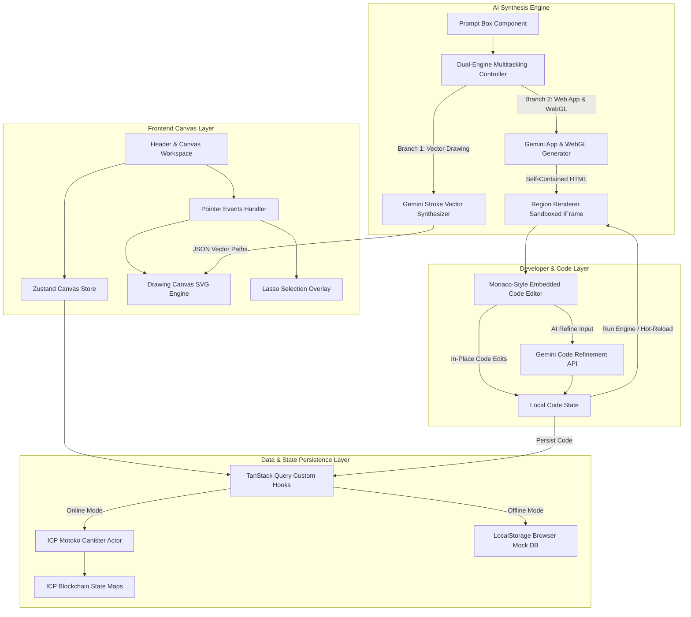

# 🏛️ SketchForge Platform — Comprehensive Technical Charter & Master Implementation Plan

This master charter document defines the complete technical architecture, component wiring, event pipelines, AI synthesis engines, embedded Monaco IDE specs, and deployment lanes for **SketchForge** — a decentralized, serverless AI visual drafting table where hand-drawn wireframes and natural language prompts compile into live web applications, 3D WebGL scenes, and on-chain ICP canisters.

---

## 📐 1. System Architecture & Core Component Wiring



---

## ⚙️ 2. Detailed Technical Specifications by Subsystem

### A. Data & State Synchronization Layer (`use-canvas-data.ts`)
1. **Actor Accessor**: `useActor` initializes the Candid interface binding for the Motoko canister actor.
2. **Local-First Fallback (`mockDb`)**:
   - Detects if `actor` is `null` (standalone mode).
   - Intercepts all queries (`getProject`, `getTabs`, `getStrokes`, `getRegions`, `getComments`, `getPresence`) and mutations (`createRegion`, `updateRegion`, `addStroke`, `createTab`).
   - Reads/writes state directly to `localStorage` under keys `sf_project`, `sf_tabs`, `sf_strokes_<tabId>`, `sf_regions_<tabId>`, preserving BigInt conversions and timestamps.

### B. AI Synthesis Engine & Model Resolution (`html-generator.ts`)
1. **API Key Resolution Hierarchy**:
   ```
   localStorage ("sketchforge_gemini_api_key") 
     ➔ import.meta.env.VITE_GEMINI_API_KEY 
       ➔ DEFAULT_API_KEY ("YOUR_GEMINI_API_KEY")
   ```
2. **Automated Retry Pipeline**:
   - `callGeminiApi` executes `fetchGeminiWithModel("gemini-2.5-flash", ...)` first.
   - On error or rate-limit, it automatically retries with `fetchGeminiWithModel("gemini-1.5-flash", ...)`.
3. **CDN Injections**:
   - Injects Tailwind CSS (`https://cdn.tailwindcss.com`), Three.js (`https://cdnjs.cloudflare.com/ajax/libs/three.js/r128/three.min.js`), FontAwesome (`https://cdnjs.cloudflare.com/ajax/libs/font-awesome/6.4.0/css/all.min.css`), and Chart.js (`https://cdn.jsdelivr.net/npm/chart.js`).
4. **Dual-Engine Multitasking Execution**:
   - **Vector Drawing**: `generateDrawingStrokes` parses prompt and box dimensions, queries Gemini for stroke JSON arrays (`points`, `tool`, `size`, `color`), and passes them to `addStroke.mutateAsync`.
   - **Web App Generation**: `generateHtmlAsync` normalizes drawn stroke coordinates relative to the region box $(x-rx, y-ry)$, injects them into the Gemini system prompt context, cleans markdown fences (`cleanHtmlOutput`), and persists the HTML.

### C. Monaco-Style Code Editor (`GeneratedRegionCard.tsx`)
1. **Editor Workspace Layout**:
   - Integrated floating mode switcher: `[Preview | Monaco IDE]`.
   - **Line Numbers Gutter**: Calculates line count dynamically (`localHtml.split('\n').length`) and renders a numbered vertical gutter (`#141424`).
   - **Syntax & Filter Tabs**: Switch between `ALL`, `HTML`, `CSS`, `JS`.
   - **Toolbar Controls**: Line/character counter display, **Fullscreen Editor Toggle**, and **Run Engine** hot-reload button.
2. **In-Place AI Code Refinement**:
   - Input bar connects to `refineHtmlAsync`.
   - Prompts Gemini with current HTML + instruction, cleans output, updates local editor state, and auto-saves to backend/local storage.

### D. Architecture Visual Pipeline (`CanvasWorkspace.tsx`)
1. **SVG Connecting Curves**:
   - Iterates through active tab regions array `(regions ?? [])`.
   - Computes center coordinates $(x_i, y_i)$ for region $i$ and $(x_{i+1}, y_{i+1})$ for region $i+1$.
   - Renders a sketchy SVG quadratic Bézier curve:
     $$d = \text{"M } x_1 \ y_1 \ \text{Q } mx \ (my - 30) \ x_2 \ y_2\text{"}$$
   - Applied with dashed stroke `oklch(0.62 0.22 285 / 0.4)` and `.sketch-rough` SVG filter.

---

## 🛠️ 3. Full Implementation File Map

| Component / File | Purpose & Responsibilities | Key Methods / Exports |
| :--- | :--- | :--- |
| **[html-generator.ts](file:///E:/sketchforge-main/sketchforge-main/src/frontend/src/lib/html-generator.ts)** | AI generation engine, model retries, CDN injections, vector parsing | `generateHtmlAsync`, `generateDrawingStrokes`, `refineHtmlAsync`, `getEffectiveApiKey` |
| **[PromptBox.tsx](file:///E:/sketchforge-main/sketchforge-main/src/frontend/src/components/PromptBox.tsx)** | User prompt submission, dual-engine stroke drawing & app creation | `handleGenerate`, `handleAISecondSketch` |
| **[GeneratedRegionCard.tsx](file:///E:/sketchforge-main/sketchforge-main/src/frontend/src/components/GeneratedRegionCard.tsx)** | Region card container, drag/resize handles, Monaco IDE editor | `GeneratedRegionCard`, `handleApplyCode`, `handleRefine` |
| **[CanvasWorkspace.tsx](file:///E:/sketchforge-main/sketchforge-main/src/frontend/src/components/CanvasWorkspace.tsx)** | Infinite panning/zooming workspace, SVG region connectors | `CanvasWorkspace`, SVG connector overlay |
| **[DrawingCanvas.tsx](file:///E:/sketchforge-main/sketchforge-main/src/frontend/src/components/DrawingCanvas.tsx)** | SVG stroke renderer for pen/eraser tools | `DrawingCanvas`, `onPointerDown`, `onPointerMove` |
| **[use-canvas-data.ts](file:///E:/sketchforge-main/sketchforge-main/src/frontend/src/hooks/use-canvas-data.ts)** | TanStack Query data hooks with `localStorage` mock DB | `useRegions`, `useCreateRegion`, `useStrokes`, `mockDb` |
| **[main.mo](file:///E:/sketchforge-main/sketchforge-main/src/backend/main.mo)** | Motoko backend actor canister for on-chain state storage | `CanvasApi`, `VersionHistoryApi`, `PresenceApi`, `OQL` |
| **[README.md](file:///E:/sketchforge-main/sketchforge-main/README.md)** | Developer documentation, spatial math formulas, Git commands | Platform documentation & setup guide |

---

## 🧪 4. Comprehensive Verification & QA Plan

### Step 1: Code Base Verification
- Run TypeScript static typechecker:
  ```bash
  pnpm run typecheck
  ```
  *(Must return 0 errors).*
- Run production bundle compilation:
  ```bash
  pnpm run build
  ```
  *(Must generate `dist/` bundle cleanly).*

### Step 2: Runtime Flow Verification
1. Boot development server: `pnpm --filter @caffeine/template-frontend run dev`.
2. Open `http://localhost:5173`.
3. Select pen tool and draw wireframe shapes.
4. Lasso the wireframe region and type a prompt (e.g. *"Build an interactive 3D WebGL particle simulator"*).
5. Click **Generate App**:
   - Verify colorful vector wireframe strokes are drawn onto the canvas paper.
   - Verify Gemini API generates and renders the responsive 3D WebGL app.
6. Click the card and select **Monaco IDE**:
   - Verify line numbers gutter, character count, and code tabs (`ALL`, `HTML`, `CSS`, `JS`).
   - Edit HTML code and click **Run Engine** to verify hot-reloading inside the sandboxed iframe.
   - Type an AI refinement instruction (e.g. *"Change primary theme color to emerald"*) and click **Refine** to verify in-place code modification.
7. Create a second region and verify that a sketchy dashed connecting curve links the two cards together into a visual architecture pipeline.

### Step 3: GitHub Deployment Pipeline
Push the full platform code to the GitHub remote:
```powershell
git init
git remote add origin https://github.com/FreddyCreates/sketchforge.git
git add .
git commit -m "feat: complete SketchForge platform MVP with AI engine, Monaco IDE, and visual architecture connectors"
git branch -M main
git push -u origin main
```
