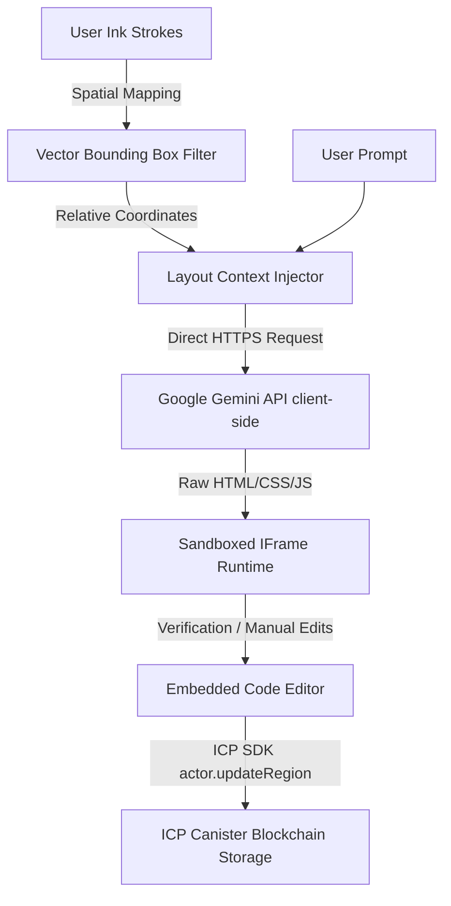

# 🛠️ SketchForge — Decentralized AI-to-UX Canvas

**SketchForge** is a hand-drawn, collaborative web canvas where freehand strokes and lassoed regions translate directly into live, interactive web interfaces and 3D renderings served directly from decentralized blockchain canisters.

---

## 🚀 Key Platform Features

- 🎨 **Visual Lasso & Ink Recognition**: Circle your hand-drawn canvas wireframes. The spatial recognition engine captures stroke vectors and feeds them to the AI to guide layout composition.
- ⚡ **Automated AI App Engine**: Leverages client-side Google Gemini (`gemini-2.5-flash` with automatic `gemini-1.5-flash` fallback) to generate responsive HTML, Tailwind styling, and JavaScript logic instantly.
- 📐 **3D & Diagram Support**: Injects and compiles Three.js scenes, Chart.js diagrams, and custom fonts natively from a simple text prompt.
- 💻 **Embedded IDE & Hot Reloads**: Toggle to the `Edit Code` pane inside any card to edit HTML/CSS/JS directly. Hit **Run** to reload the sandboxed iframe engine, or use the **Refine with AI** command input to update code in-place.
- 👥 **Real-Time Collaboration**: Presence cursors, colour-coded collaborator chips, shared version history, and interactive comment pins allow cross-functional teams to work in real-time.
- 🌐 **Sovereign Web3 Storage**: Stores application assets and version snapshots permanently on-chain in Internet Computer Protocol (ICP) canisters.

---

## 📐 Platform Architecture & Flow



### 1. Spatial Vector Recognition Math
When a user lassos sketches, the canvas calculates the bounding box $B = (x_{min}, y_{min}, w, h)$. Strokes represented as sequences of vertices $P = \{p_1, \dots, p_n\}$ are selected if any point $p=(x,y)$ satisfies:

$$x_{min} \le x \le x_{min} + w \quad \land \quad y_{min} \le y \le y_{min} + h$$

The vertices are normalized to region-relative coordinates:

$$p'_{i} = \left( x_i - x_{min}, y_i - y_{min} \right)$$

These relative lines, circles, and curves are injected into the Gemini prompt context, guiding the model to place buttons, menus, and headers matching your drawn layout.

---

## 🛠️ Local Setup & Operation

### Prerequisites
- Node.js >= 18.0.0
- pnpm (package manager)

### 1. Synchronize API Credentials
To set your Gemini API Key safely in your local environment file (shielded from git and command logs), open PowerShell and run:

```powershell
$val = Read-Host -AsSecureString "Enter your Gemini API Key"; $BSTR = [System.Runtime.InteropServices.Marshal]::SecureStringToBSTR($val); $PlainKey = [System.Runtime.InteropServices.Marshal]::PtrToStringAuto($BSTR); Add-Content -Path ".env.local" -Value "VITE_GEMINI_API_KEY=$PlainKey"; Write-Output "Saved to .env.local"
```

### 2. Install Dependencies
Run the following from the root workspace directory:
```bash
pnpm install
```

### 3. Spin Up the Platform Local Dev Server
```bash
pnpm --filter @caffeine/template-frontend run dev
```
Open **`http://localhost:5173`** in your browser. The app runs in a fully functional **Local-First Fallback Mode** (saving canvas data to browser `localStorage` if no replica is running).

---

## 🔗 Native Deployment (ICP Blockchain)

To bypass proprietary cloud frameworks and deploy the platform natively to the Internet Computer Protocol (ICP):

1. **Start the native replica** in background:
   ```bash
   dfx start --background --clean
   ```
2. **Deploy canisters natively**:
   ```bash
   pnpm run deploy:native
   ```

---

## 📤 Push Changes to GitHub

To push your updates, commits, and additions to your Git repository:

1. **Initialize/Check Git Status**:
   ```bash
   git status
   ```
2. **Stage Your Changes**:
   ```bash
   git add .
   ```
3. **Commit**:
   ```bash
   git commit -m "feat: integrate client-side Gemini API engine, embedded IDE, and AI sketching"
   ```
4. **Push**:
   ```bash
   git push origin main
   ```
   *(Change `main` to your target branch if working on a feature branch).*
